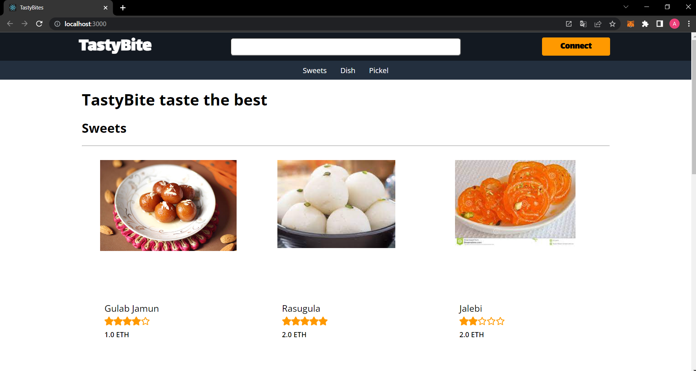
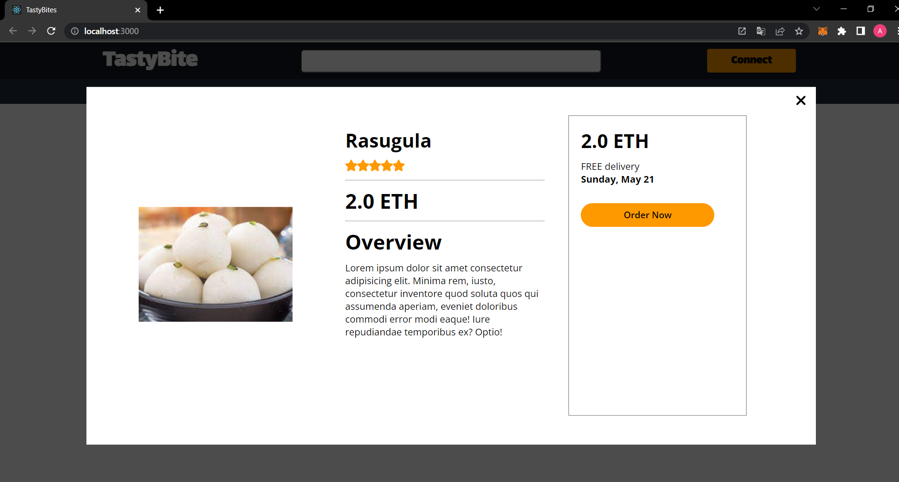
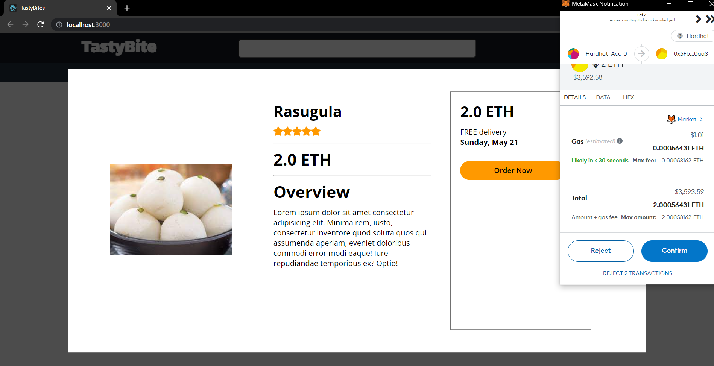
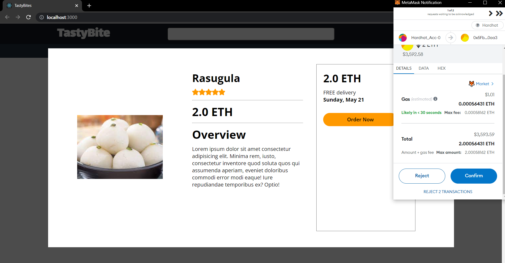

# TastyBite - taste the best
---
## Contents:
1. [Introduction](#introduction)
2. [Contract Overview](#contract-overview)
3. [Contract Structure](#contract-structure)
4. [Setup Guide](#setup-guide)
5. [Deployment Instruction](#deployment-instructions)
6. [Integration Guide](#integration-guide)
7. [Planning](#planning)
8. [Conclusion](#conclusion)
9. [Reference](#references)
10. [Snaphshots of App](#snapshots-of-an-application)
---
## Introduction
Welcome to the TastyBite documentation! This documentation provides an overview of the TastyBite project and details about the smart contract that powers it.

TastyBite is a decentralized application (DApp) built using hardhat. It aims to revolutionize the food industry by providing a secure and transparent platform for ordering food items. The smart contract serves as the backbone of the TastyBite platform, handling the listing of food items, placing orders, and managing payments.

This documentation will guide you through the different components of the TastyBite smart contract, explain their functionalities, and provide instructions on deploying the contract and integrating it with frontend applications. Whether you are a developer looking to understand the inner workings of the contract or a user interested in learning how to interact with the platform, this documentation will serve as your comprehensive guide.

Let's deep dive into TastyBite!

## Contract Overview
The TastyBite smart contract provides functionality for listing food items, placing orders, and managing payments. The list function is restricted to the contract owner, enabling them to list new food items by providing the necessary details. Users can use the buy function to purchase items by specifying the item ID and sending the required funds. The contract verifies the payment and item availability before creating an order and updating the stock. The withdraw function allows the contract owner to withdraw the accumulated funds.

The contract utilizes mappings to store items, orders, and order counts for each user. Events are emitted to notify external systems about important contract activities, such as listing new items and successful purchases. The contract owner plays a crucial role in managing the system by listing items and withdrawing funds.

## Contract Structure

The TastyBite Smart Contract consists of the following components:

- **State Variables**:
  - `owner`: Stores the address of the contract owner.
  - `items`: A mapping that associates item IDs with their corresponding `Item` struct.
  - `orderCount`: A mapping that tracks the number of orders placed by each user.
  - `orders`: A nested mapping that stores the orders placed by users.

- **Structs**:
  - `Item`: Represents a food item, containing properties such as ID, name, category, image, cost, rating, and stock.
  - `Order`: Represents an order, including the timestamp and the associated `Item`.

- **Modifiers**:
  - `onlyOwner`: A modifier that restricts certain functions to be called only by the contract owner.

- **Events**:
  - `Buy`: Triggered when a user successfully purchases an item, emitting the buyer's address, order ID, and item ID.
  - `List`: Triggered when an item is listed, emitting the item name, cost, and available quantity.

- **Functions**:
  - `constructor`: Initializes the contract and sets the owner to the deployer's address.
  - `list`: Allows the contract owner to list a new food item by specifying its details, storing it in the `items` mapping, and emitting the `List` event.
  - `buy`: Enables users to purchase an item by providing the item ID and sending sufficient funds. It verifies the payment, item availability, creates an order, updates the stock, and emits the `Buy` event.
  - `withdraw`: Allows the contract owner to withdraw the accumulated funds from the contract.

  ---
  TODO:
  For pseudo code of other smart contracts follow this [Pseudo Codes](./Implementation/)

  ---

## Setup Guide

 [Follow this](./Implementation/README.md) 

## Deployment Instructions

To deploy the TastyBite Smart Contract, follow these steps:

1. Clone this repository and navigate to the project directory.
2. Install the project dependencies by running the following command:

   ```shell
   npm install
3. Configure the parameters of deploy.js it present in Implementation->scripts->deploy.js.
4. Deploy the smart contract using following command and replace the name of the network with your targeted network in our case we used hardhat.
   ```shell   
   npx hardhat run scripts/deploy.js --network <network>
5. Once the deployment is successfull it script with output the deployed contract address.

## Integration Guide
1. Install Required Packages:
```
npm install ethers chai
```  
2. Import  chai, ether and hardhat:
- To importing the above libraries use following lines of code
```
const { expect } = require("chai")
import { ethers } from 'ethers'
const hre = require("hardhat")
```
3. Deploying the smart contract 
- To deploy smart contract follow 2 steps as follows:
  1. Setup the accounts of deployer by using following lines of code :
  ```
  const [deployer] = await ethers.getSigners()
  ```
  2. Deploy the smart contract using following code:
  ```
  const Tasty = await hre.ethers.getContractFactory("TastyBite")
  const tasty = await Tasty.deploy()
  await tasty.deployed()
  ``` 
4. Connecting Application with the blockchain
- To connecting frontend with the blockchain use below code
```
const provider = new ethers.providers.Web3Provider(window.ethereum)
setProvider(provider)
```
- Now Check the network
```
const network = await provider.getNetwork()
console.log(network)
```
- Now to interact with smart contract create js version of smart contract by ether.js using following code:
```
const tasty = new ethers.Contract(config[network.chainId].TastyBites.address, 
      TastyBite, 
      provider 
)
setTastyBites(tasty)

```
---
By storing the js version of smart contract in "tasty" variable we successfully connect our smart contract with frontend. Now to test it follow the instruction of [Deployment](#deployment-instructions) section.

---

## Planning 

[Highlevel Overview of TastyBite](./bussinessLogic/README.md)

## Conclusion
While doing this project we learn:
How to define and deploy a smart contract using Solidity and Hardhat. And then how to connect it with the frontend.
- The use of modifiers to restrict access to certain functions.
- Creating data structures such as structs and mappings to store and retrieve information.
- Handling transactions and events within the smart contract.
- Integrating external JSON data to list items dynamically.

By combining blockchain technology with a decentralized application like TastyBite, you can provide a transparent and secure platform for food ordering and delivery services.

`Feel free to explore and enhance the functionality of the TastyBite Smart Contract. You can further integrate it with your front-end applications, add more features like order tracking, or even expand it to support a complete food delivery ecosystem. `

Thank you for following this documentation. If you have any questions or feedback, please don't hesitate to reach out to me. 

## References
 **Papers**
1. [Blockchain Adoption in Food Supply Chains](./Research-Paper/Blockchain_Adoption_in_Food_Supply_Chains_A_Systematic_Literature_Review_on_Enablers_Benefits_and_Barriers.pdf)
2. [Blockchain for Industry 5.0](\Research-Paper\Blockchain_for_Industry_5.0_Vision_Opportunities_Key_Enablers_and_Future_Directions.pdf)

**Tutorial**
 1. [Blockchain from beginner to advance](https://www.youtube.com/watch?v=gyMwXuJrbJQ&t=545s)

## Snapshots of an Application
- Application Page: 



- Payment Window : 



- Payment Processing :



- Final Payment Status :




