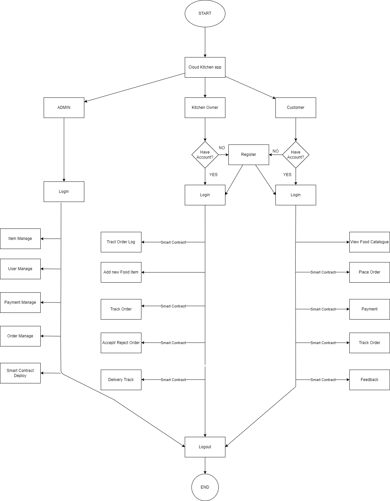

# Blockchain-based-Cloud-Kitchen-Application


----Planning 


Things to be implemented on Traditional Backend


Things to be implemented on Blockchain


1] Order contract
- creation of order
- deletion of order
- modification of order
- Get all orders (Order History)
- GetOrderbyid

2] Payment contract
- initiate payment
- verify payment
- transaction history
  
3] Loyality and Reward contract
- offers on deals
- point rewards on purchess

4] Feedback and review contract
-collect and display feedback

---------------------------------------------------

Major Pages

1] Dashboard 
 - Home
 - Profile
 - Orders
 - feedback (d)
 - Reward (d)
 - etc.

2] Food Catalogue

3] Payment Window (d)

4] order Tracking (d)

---------------------------------------------------
Functional Requirements

Users

i) C Kitchen Owner

- Should be able to create his/her account
- Should be able to login
- Should be able to see all the orders placed by customers acc to timestamp
- Should be able to Accept or Reject the order.
- Should be able to See his daily orders.
- Track order status.
- Should be able to give feedback.
- Should be able to logout.

ii) Customer
- Should be able to create a new account.
- Should be able to login
- Should be able to view all the Food Catelogue
- Should be able to place order.
- Should be able to do Payments.
- Should be able to track order status.
- Should be able to give Feetback.
- Should be able to logout.
- 
-----------------------------------------------------------------------------------------------------

Models

1]User
- UName
- Email
- Password
- phone
- Fname
- Lname
- Age
- location


2]Order

-id
-dish[] []
-price
-payment type
-payment status

3]Customer
-User[1]
-orders[][2]

4]KitchenOwner
-User[1]
-Kitchen[][6]

5]Dish
- rating
- name
- type
- description
- price
- number of orders
- offer

6] Kitchen
- Dish[][5]
- offer
- location

**Flow Chart**



**Sequence Diagram**
```+-------------------------------------------------+
|               Online Shopping System             |
+-------------------------------------------------+
           |              |              |
           |              |              |
+------------------+ +------------------+ +------------------+
|    Customer      | |     Website      | |    Warehouse     |
+------------------+ +------------------+ +------------------+
           |              |              |
           |              |              |
+------------------+ +------------------+ +------------------+
|     Payment      | |    Order System  | |    Inventory     |
+------------------+ +------------------+ +------------------+
           |                           |              |
           |                           |              |
           |                 +----------------+       |
           |                 |  Shipping      |       |
           |                 +----------------+       |
           |                           |              |
           +---------------------------+--------------+
                                       |
                               +---------------+
                               |  Delivery     |
                               +---------------+ 
